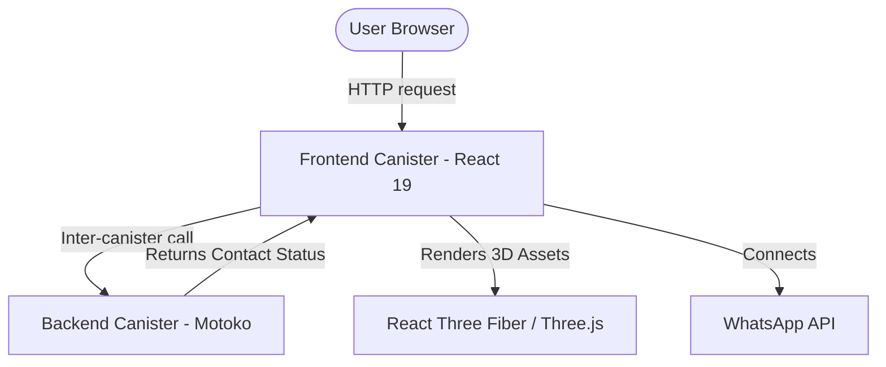

# 🪐 PLATYPHY

> **Architecting Intelligent Digital Ecosystems.**  
> Enterprise-grade software platforms engineered for high performance, decentralized resilience, and exponential growth.

[](https://internetcomputer.org)
[](https://internetcomputer.org/docs/current/motoko/main/motoko)
[](https://react.dev)
[](https://pnpm.io)
[](LICENSE)

---

PLATYPHY is an advanced, enterprise-grade decentralized landing page application built on the **Internet Computer (ICP)**. It marries a premium, high-fidelity React frontend with a secure, high-performance Motoko smart contract backend. Featuring futuristic dark glassmorphism styling, interactive 3D visualizations, and robust state checks, PLATYPHY shows how modern enterprise web experiences can run fully on-chain.

## 🚀 Key Features

*   **🌌 Futuristic Glassmorphic Design:** A premium landing page styled with custom gradients, glassmorphism cards, animated backgrounds, responsive grids, and subtle micro-interactions for a world-class user experience.
*   **🔌 On-Chain Decentralized Backend:** A smart contract canister written in **Motoko** that handles business logic, including inquiry capture (`addContact`), running fully on the Internet Computer blockchain.
*   **🎭 3D Concept Visualizer:** Immersive 3D interactive shapes built with **Three.js**, **React Three Fiber**, and **Drei** to represent digital infrastructure concepts visually.
*   **📊 Real-Time Metrics & Showcase:** Sleek visual grids containing mock metrics, active technology stack breakdowns, global presence maps, and customer trust ratings.
*   **💬 Integrated Floating Widgets:** Includes a WhatsApp contact button and an interactive "Ask Connective AI" floating assistant modal.
*   **⚖️ Embedded Legal Protections:** Built-in modal components for Terms of Service and Privacy Policy.
*   **📦 Containerized Dev Environment:** A comprehensive multi-stage `Dockerfile` pre-packaging `node`, `pnpm`, `ic-mops`, `icp-cli` and `motoko` SDK compilers to ensure standard builds.

---

## 🛠️ Architecture Overview

The codebase is organized as a monorepo using **pnpm workspaces** to orchestrate dependencies, local builds, and canisters.



### Directory Structure

```text
├── backend/                         # Legacy backend source files
├── frontend/                        # Legacy/shared public configurations
├── src/                             # Main monorepo workspace directory
│   ├── backend/                     # Backend Canister
│   │   ├── canister.yaml            # Backend canister definition
│   │   └── main.mo                  # Motoko Actor for contact requests
│   └── frontend/                    # Frontend React Canister
│       ├── canister.yaml            # Frontend canister definition
│       ├── package.json             # Frontend dependencies & scripts
│       ├── postcss.config.js
│       ├── tailwind.config.js       # Tailwind system configuration
│       ├── vite.config.js           # Vite server config with environment variables
│       ├── public/                  # Static assets & images (Futuristic Bg, Favicon)
│       └── src/
│           ├── App.tsx              # Application layout & section router
│           ├── main.tsx             # React mount point
│           ├── components/          # Reusable modules (Preloader, Legal, Floating widgets)
│           │   ├── ui/              # Shadcn components (Dialogs, Cards, Carousel, etc.)
│           │   └── landing/         # Custom section components
│           ├── config/              # Centralized asset URLs & whatsapp details
│           ├── hooks/               # Custom React hooks (ICP Actor integration, ripple, etc.)
│           └── lib/                 # Utility files (Framer motion configurations)
├── Dockerfile                       # Multi-stage image build environment for ICP SDK
├── deploy.sh                        # Bash script to automate local canister deployments
├── package.json                     # Monorepo root config
├── pnpm-workspace.yaml              # pnpm workspaces specification
└── tsconfig.json                    # Root Typescript compiler options
```

---

## ⚙️ Getting Started

### Method 1: Using Docker (Recommended)

The easiest way to build and run the development network containerized is using the provided `Dockerfile`. This avoids the need to install the Dfinity/Motoko compiler toolchains locally.

1.  **Build the Docker Image:**
    ```bash
    docker build -t platyphy-app .
    ```
2.  **Run the Container:**
    ```bash
    docker run -it --network host platyphy-app
    ```
    *This runs the `deploy.sh` script inside the container, starting a local replica and deploying the frontend/backend canisters.*

---

### Method 2: Manual Local Setup

If you prefer to run the application on your host machine:

#### Prerequisites

1.  **Node.js & PNPM:** Ensure you have Node.js (>=16) and `pnpm` installed.
2.  **ICP CLI:** Install the Internet Computer SDK (`dfx` or `icp-cli`).
    ```bash
    # For dfx / icp-cli
    sh -ci "$(curl -fsSL https://internetcomputer.org/install.sh)"
    ```

#### Installation & Deployment

1.  **Install Workspace Dependencies:**
    From the root directory, install all workspace packages:
    ```bash
    pnpm install
    ```

2.  **Start Local Replica:**
    Run the local blockchain network in the background:
    ```bash
    icp network start --background
    ```

3.  **Deploy Canisters:**
    Create, compile, and deploy the canisters:
    ```bash
    icp deploy --environment local
    ```

4.  **Run Frontend Dev Server:**
    Run Vite for the frontend package:
    ```bash
    pnpm --filter @caffeine/template-frontend run start
    ```
    Open `http://localhost:3000` to interact with the application.

---

## 💻 Available Scripts

Run these commands from the root directory to manage the workspaces:

*   `pnpm install`: Install packages across the workspace.
*   `pnpm run build`: Compile and build both the frontend static site and backend artifacts.
*   `pnpm run start`: Launch development servers.
*   `pnpm run test`: Run tests across workspaces.

For specific frontend tasks:
*   `pnpm --filter @caffeine/template-frontend run typescript-check`: Perform TypeScript static checks.
*   `pnpm --filter @caffeine/template-frontend run format`: Format frontend source files with Prettier.
*   `pnpm --filter @caffeine/template-frontend run lint`: Lint front-end code with ESLint.

---

## 📜 License

This project is licensed under the MIT License. See the [LICENSE](LICENSE) file for details.
